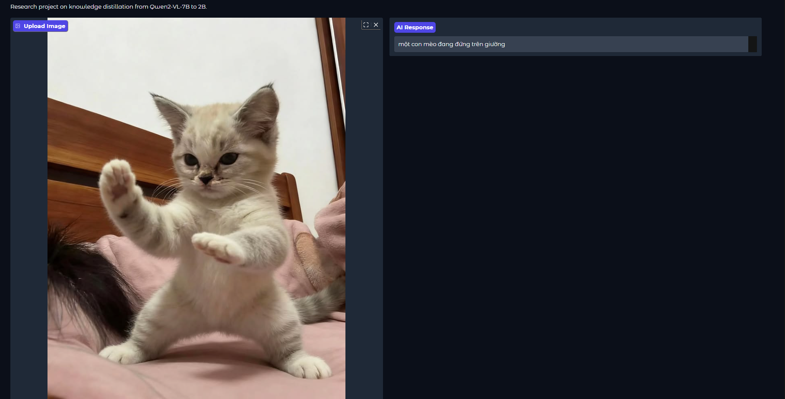

# Vi-VQA - Vietnamese Visual Question Answering

Dự án VQA tiếng Việt sử dụng Knowledge Distillation từ Qwen2-VL-7B (Teacher) sang Qwen2-VL-2B (Student).

## Cấu trúc dự án

```
Pine_line/
├── configs/                    # Cấu hình YAML
│   ├── teacher.yaml            # Config train teacher 7B
│   └── student.yaml            # Config distill student 2B
├── notebooks/                  # Source notebooks gốc (tham khảo)
├── scripts/                    # Scripts chạy Python
│   ├── train_teacher.py        # Train teacher model
│   ├── train_distill.py        # Knowledge distillation
│   ├── inference.py            # Test inference
│   └── run_api.py              # Chạy API + Gradio UI
├── src/                        # Module code
│   ├── teacher/                # Teacher model utils
│   ├── distillation/           # Distillation utils
│   ├── inference/              # Common inference
│   └── api/                    # API & UI
├── models/                     # Lưu trained models
├── outputs/                    # Checkpoints
└── README.md
```

## Yêu cầu phần cứng

| Task | VRAM | GPU |
|------|------|-----|
| Train Teacher (7B) | ~22GB | L4, A10G, A100 |
| Train Student (2B) | ~12GB | T4, L4 |
| Inference | ~8GB | T4, L4 |

## Cài đặt

### 1. Tạo virtual environment (khuyến nghị)

```bash
python -m venv venv
source venv/bin/activate  # Linux/Mac
# venv\Scripts\activate   # Windows
```

### 2. Cài đặt dependencies

```bash
# Cài unsloth (tự động cài các package cần thiết)
pip install unsloth

# Hoặc dùng requirements.txt
pip install -r requirements.txt
```

## Cách chạy

### 1. Train Teacher Model (7B)

Train model 7B từ pretrained Qwen2-VL-7B-Instruct.

```bash
python scripts/train_teacher.py
```

**Output**: `models/teacher/` chứa LoRA weights và tokenizer

---

### 2. Knowledge Distillation (7B → 2B)

Distill knowledge từ teacher 7B sang student 2B.

```bash
python scripts/train_distill.py
```

**Trước khi chạy**: Chỉnh `configs/student.yaml` trỏ đến teacher checkpoint:

```yaml
teacher:
  path: "models/teacher"
```

**Output**: `models/student/`

---

### 3. Inference (Test nhanh)

Test model đã train với 1 ảnh và câu hỏi.

```bash
# Dùng pretrained model từ HuggingFace
python scripts/inference.py -i test.jpg -q "Mô tả bức ảnh"

# Dùng model đã train
python scripts/inference.py -i test.jpg -q "Mô tả bức ảnh" -m models/student
```

---

### 4. Chạy API Server + Gradio UI

Chạy FastAPI backend + Gradio frontend.

```bash
python scripts/run_api.py
```

**Truy cập:**
- Gradio UI: http://localhost:7860
- API Docs: http://localhost:8000/docs

### Demo giao diện



---

## Luồng huấn luyện hoàn chỉnh

```bash
# Bước 1: Train Teacher
python scripts/train_teacher.py

# Bước 2: Distill sang Student
python scripts/train_distill.py

# Bước 3: Test inference
python scripts/inference.py -i test.jpg -q "Mô tả bức ảnh"

# Bước 4: Deploy API
python scripts/run_api.py
```


## Xử lý lỗi thường gặp

### Lỗi OOM (Out of Memory)
- Giảm `batch_size` trong config
- Tăng `gradient_accumulation_steps`

### Lỗi truncation khi train
```yaml
# Trong configs/teacher.yaml
image_processor:
  max_pixels: 256 * 28 * 28
  min_pixels: 128 * 28 * 28
```

## Scripts

| Script | Mục đích |
|--------|----------|
| `scripts/train_teacher.py` | Train teacher model 7B |
| `scripts/train_distill.py` | Knowledge distillation 7B→2B |
| `scripts/inference.py` | Test inference đơn lẻ |
| `scripts/run_api.py` | Chạy FastAPI + Gradio UI |

## Modules

| Module | Mô tả |
|--------|--------|
| `src/teacher/` | Load & train teacher model |
| `src/distillation/` | Student model & distillation loop |
| `src/inference/` | Common inference functions |
| `src/api/` | FastAPI backend & Gradio frontend |